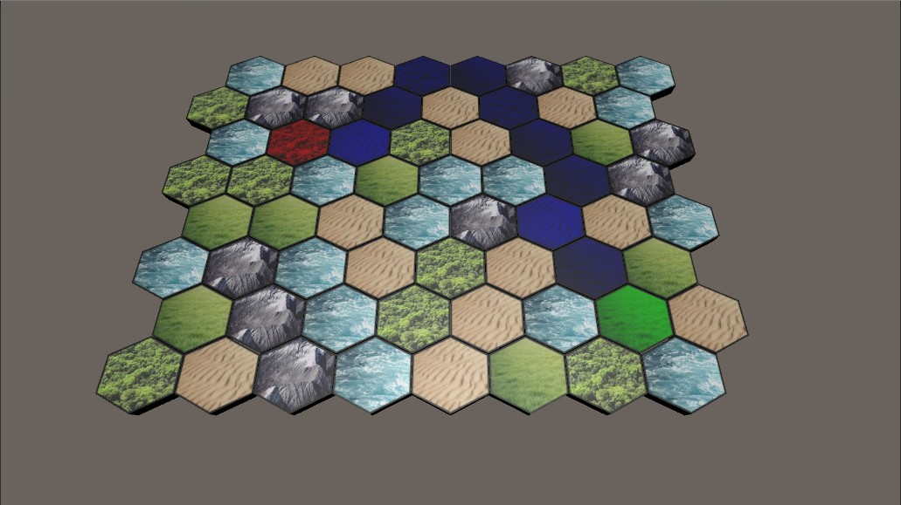

# Intro to AStar Assignment
This assignment uses the already provided AStar algorithm to show the best path on a hexagonal tilemap.

<h2>Unity Version</h2>
The project was made in Unity 2019.4.1f1.

<h2>How to use</h2>
To select the starting tile, click on a traversable tile with your left mouse button. To select the ending tile (or the goal tile) do the same, but use the right mouse button.
When both tiles are selected you will automatically see the path from the starting to the ending tile.  

You should see something like this:  

<h4>The default tile colors are:</h4>

- Starting tile - Green
- Ending tile - Red
- Found path tile - Blue
  

<h4>The path will NOT show when:</h4>

- There is only one selected tile (only starting or only the ending tile)
- A path was not found
  

<h4>The tile selection will not work when:</h4>
  
- Trying to select a tile that is not traversable
- Trying to select a tile that is already a starting/ending tile

<h2>Features</h2>

- Hexagonal tilemap generation 
- Selecting hexagonal tiles with the mouse 
- Path visualization 
